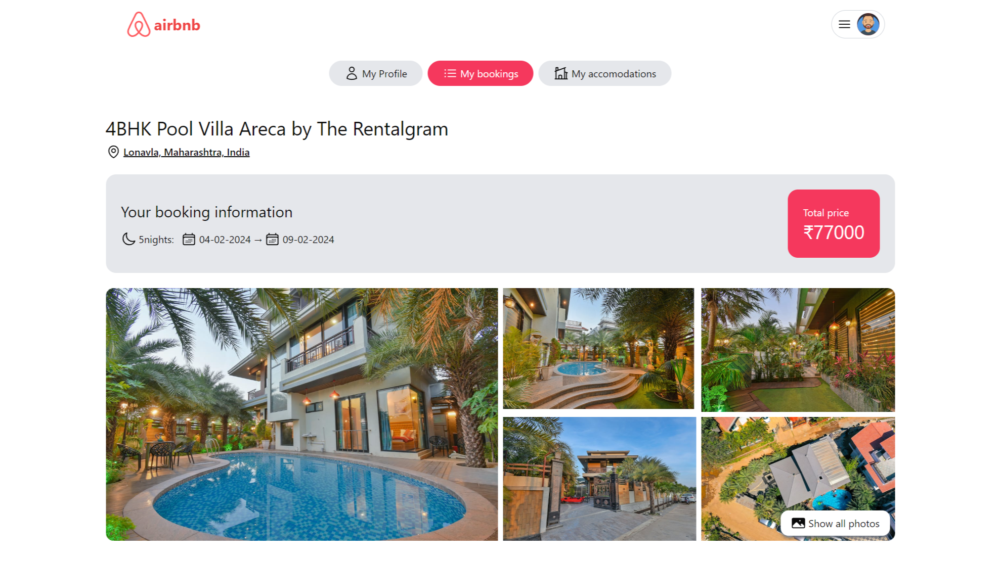

# 🏠 Airbnb Clone

## 📝 Overview

This project is a full-stack web application developed as a clone of Airbnb using the MERN stack (MongoDB, Express.js, React.js, Node.js). It aims to replicate the core functionality of Airbnb, allowing users to search for accommodations, view details, make bookings, and manage their listings.

## 🚀 Getting Started

1. **Clone the Repository:** 📂

   ```bash
   git clone https://github.com/nashutosh/airbnb-clone.git
   ```

2. **Install dependencies:** 📦

   Navigate to client directory and install frontend dependencies using yarn

   ```
   yarn install
   ```

   Similary navigate to api folder and install backend dependencies

   ```
   yarn install
   ```

3. **ENV variables:** 🔐

   - create .env file in the client folder and add these variables

     #### VITE_BASE_URL= http://localhost:4000

     #### VITE_GOOGLE_CLIENT_ID= your google client id

   - create .env file in the api folder and add these variables

     #### PORT= 4000

     #### DB_URL= your db url

     #### JWT_SECRET= your secret (string)

     #### JWT_EXPIRY= 20d

     #### COOKIE_TIME= 7

     #### SESSION_SECRET= your secret session (string)

     #### CLOUDINARY_NAME= your secret session

     #### CLOUDINARY_API_KEY= your cloudinary key

     #### CLOUDINARY_API_SECRET= your cloudinary api secret

     #### CLIENT_URL= http://localhost:5173

4. **Run project:** ▶️
   - Open terminal, navigate to client directory and run below command to start frontend
   ```
       yarn run dev
   ```
   - Open another terminal, navigate to api directory and run this command to start backend server
   ```
       yarn start
   ```

## ✨ Features

- **User Authentication:** 🔒 Users can sign up, log in, and log out securely. Passwords are hashed for security.
- **Google Login:** 📧 Users can sign up and log in using their gmail.

  

- **Search Listings:** 🔍 Users can search for accommodations.

  

- **View Listings:** 👀 Users can view detailed information about each accommodation, including photos, descriptions, amenities.

  

- **Make Bookings:** 📅 Authenticated users can book accommodations for specific dates.

  

- **Manage Listings:** ⚙️ Hosts can create, edit, and delete their listings.

  

- **Responsive Design:** 📱 The application is designed to be responsive and work seamlessly across different devices.

  

## 🛠️ Technologies Used

- **MongoDB:** 🗄️ NoSQL database for storing user data, listings.
- **Express.js:** 🚂 Web application framework for building the backend server.
- **React.js:** ⚛️ JavaScript library for building the user interface.
- **Node.js:** 💻 JavaScript runtime environment for executing server-side code.
- **Tailwind CSS:** 🎨 A utility-first CSS framework
- **Shadcn:** 🎯 UI library for styling based on Tailwind CSS
- **JWT:** 🔑 JSON Web Tokens for secure user authentication.
- **Cloudinary:** ☁️ Cloud-based image management for storing and serving images.
- **Google Cloud:** 🌐 For gmail based authentication

## 👨‍💻 Author

Created with ❤️ by **Ashutosh Singh**
- Email: ashutoshsingh6376@gmail.com
